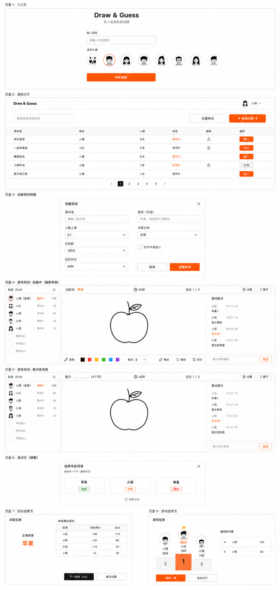

# PPDraw

一款多人在线"你画我猜"网页游戏。

> 画得丑没关系，猜得到就行。

## 设计预览



## 技术栈

- **前端**：React 19 + Vite + TypeScript + TailwindCSS + React Router + Socket.IO Client + Zustand
- **后端**：Node.js + Express + Socket.IO + TypeScript
- **共享**：`shared/` 目录存放前后端共用的类型定义和 Socket 事件协议

## 目录结构

```
PPDraw/
├── frontend/    # 前端
├── backend/     # 后端
├── shared/      # 前后端共享类型
└── README.md
```

## 快速开始

### 启动后端

```bash
cd backend
npm install
npm run dev
```

后端默认运行在 `http://localhost:3001`

### 启动前端

```bash
cd frontend
npm install
npm run dev
```

前端默认运行在 `http://localhost:5173`

## 设计规范

- 极简、克制、信息优先（参考 Linear / Vercel / Notion）
- 主色：黑白灰 + 一个克制的橙色 `#F97316` 作为强调
- 圆角统一 6px，禁止大圆角、渐变、玻璃拟态
- 字体：系统默认无衬线（Inter + PingFang SC）

## 开发计划（MVP）

- [x] 项目脚手架
- [x] 入口页（昵称 + 头像，localStorage 持久化）
- [x] 房间大厅（列表、创建、加入）
- [x] WebSocket 通信框架
- [x] 画布实时同步
- [x] 绘画工具栏（画笔、橡皮、颜色、粗细、撤销、清空）
- [ ] 回合状态机（选词 → 画 → 猜 → 结算）
- [ ] 计分与排行
- [ ] 词库（已内置基础词库，待接入流程）
- [ ] 创建房间弹窗（自定义配置）
- [ ] 快速匹配
- [ ] 断线重连完善
- [ ] 部署上线
